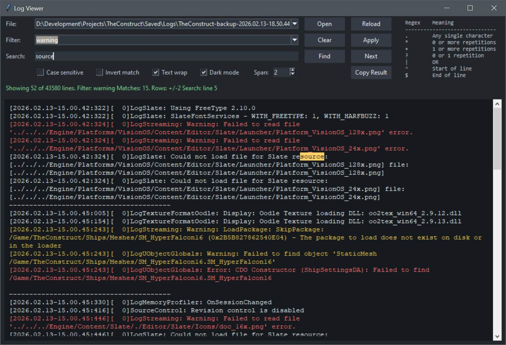

# Log Viewer



A small Tkinter-based log viewer for quickly inspecting large text and log files.
It can filter rows with regular expressions, keep useful context around matches,
highlight important lines, and remember recent files and filters in a local INI file.

## Features

- Open and reload `.log` or `.txt` files
- Regex row filtering with case-sensitive and inverted match options
- Context span around filter matches, with separators between skipped blocks
- Recent file and recent filter comboboxes
- Configurable filter presets
- Light and dark theme toggle
- Theme-aware row highlighting for warnings, errors, or custom patterns
- Classic search inside the currently visible result
- Optional text wrapping for long log rows
- Copy the current result to the clipboard

## Configuration

The app creates and reads `LogViewer.ini` next to `LogViewerApp.py`.
This file is local machine state and should usually not be committed, because it can contain absolute file paths.

Example:

```ini
[Settings]
dark_mode = yes
text_wrap = no
row_offset = 2

[RecentFiles]
file1 = D:\Logs\Example.log

[FilterPresets]
filter1 = error
filter2 = warning
filter3 = fatal

[RecentFilters]
filter1 = LogStreaming

[HighlightRules]
rule1 = error | #b00020 | #ff6b6b
rule2 = warning | #8a6500 | #f2c94c
```

Highlight rule format:

```ini
ruleX = regex | light-mode-color | dark-mode-color
```

Colors can be written as hex values like `#ff6b6b` or RGB tuples like `(220, 0, 0)`.

## Run

Windows:

```powershell
py LogViewerApp.py
```

Linux:
- Tk/Tkinter may need to be installed separately.

Arch / CachyOS:

```bash
sudo pacman -S tk
```

Debian / Ubuntu:

```bash
sudo apt install python3-tk
```

Fedora:

```bash
sudo dnf install python3-tkinter
```
